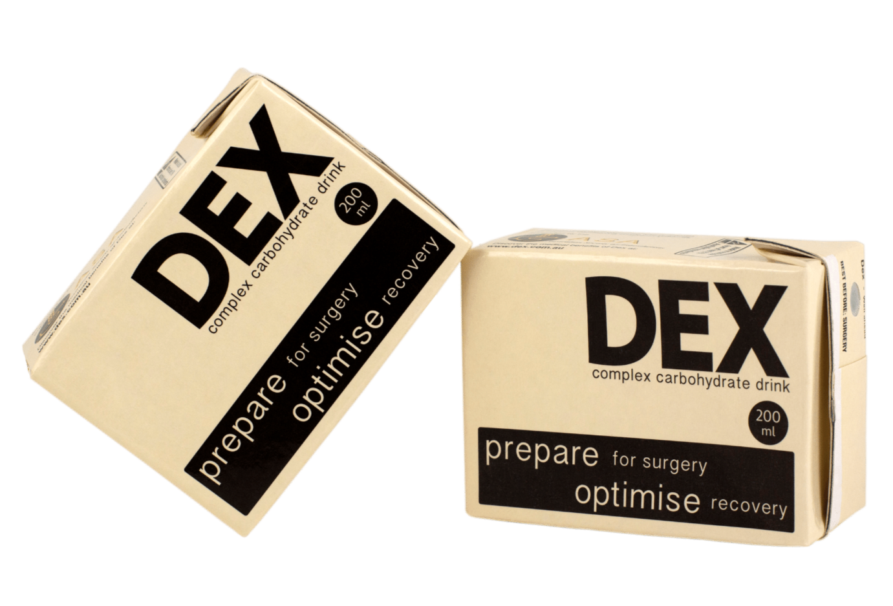

<a name="readme-top"></a>


<!-- PROJECT LOGO -->
<br />
<div align="center">
  <a href="https://github.com/yuranich/verifiable-limit-trade">
    
  </a>

<h2 align="center">Verifiable Limit Trade</h3>

  <p align="center">
    Smart contracts to accept and execute limit trade orders in verifiable and decentrilized manner.
    <br />
    <a href="https://youtu.be/6gFiSFbpynw">View Demo</a>
  </p>
</div>


<!-- TABLE OF CONTENTS -->
<details>
  <summary>Table of Contents</summary>
  <ol>
    <li>
      <a href="#about-the-project">About</a>
      <ul>
        <li><a href="#built-with">Built With</a></li>
      </ul>
    </li>
    <li>
      <a href="#getting-started">Getting Started</a>
      <ul>
        <li><a href="#prerequisites">Prerequisites</a></li>
        <li><a href="#installation">Installation</a></li>
      </ul>
    </li>
    <li><a href="#usage">Usage</a></li>
    <li><a href="#roadmap">Roadmap</a></li>
  </ol>
</details>


<!-- ABOUT THE PROJECT -->
## About

**Problem**

* Funds stored on exchange account while waiting for the strike price
* Requires trust which is the issue more and more
* Easy to slide down into using central database for projects

**Solution**

No simple solution, we should just continue pushing forward and improving current decentrilized implementations.
As integrity very important - more and more people should be involved.
Here I am just exploring possibility of doing limit trade without need to trust central authority.


<p align="right">(<a href="#readme-top">back to top</a>)</p>


### Built With

<!-- * [![Hardhat][Hardhat]][Hardhat-url]
* [![Chainlink][Chainlink]][Chainlink-url] -->
<a href="https://hardhat.org/">

</a>
<br />
<a href="https://chain.link/">

</a>


<p align="right">(<a href="#readme-top">back to top</a>)</p>


<!-- GETTING STARTED -->
## Getting Started

Clone the repo
   ```sh
   git clone https://github.com/yuranich/verifiable-limit-trade.git
   ```

### Prerequisites

- [git](https://git-scm.com/book/en/v2/Getting-Started-Installing-Git)
  - You'll know you did it right if you can run `git --version` and you see a response like `git version x.x.x`
- [Nodejs](https://nodejs.org/en/)
  - You'll know you've installed nodejs right if you can run:
    - `node --version` and get an ouput like: `vx.x.x`
- [Yarn](https://yarnpkg.com/getting-started/install) instead of `npm`
  - You'll know you've installed yarn right if you can run:
    - `yarn --version` and get an output like: `x.x.x`
    - You might need to [install it with `npm`](https://classic.yarnpkg.com/lang/en/docs/install/) or `corepack`

### Installation

```sh
yarn
```

<p align="right">(<a href="#readme-top">back to top</a>)</p>


<!-- USAGE EXAMPLES -->
## Usage

Deploy:

```sh
yarn hardhat deploy
```

Run forked mainnet node:

```sh
yarn hardhat node  --network hardhat
```

Execute script to see how it works:

```sh
yarn hardhat run scripts/putTogether.js --network localhost
```

<p align="right">(<a href="#readme-top">back to top</a>)</p>


<!-- ROADMAP -->
## Roadmap

- [ ] Add frontend
- [ ] Add other currencies

<p align="right">(<a href="#readme-top">back to top</a>)</p>


<!-- LICENSE -->
## License

Distributed under the MIT License. See `LICENSE.txt` for more information.

<p align="right">(<a href="#readme-top">back to top</a>)</p>
